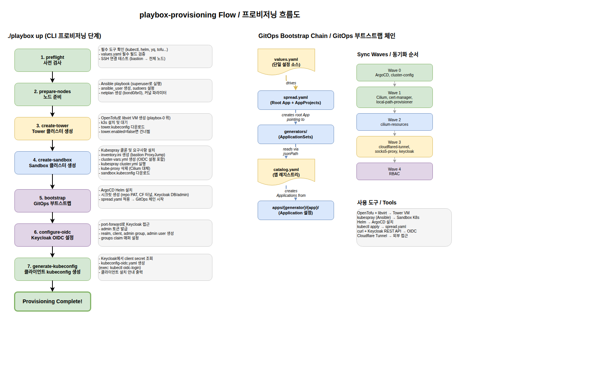

# k8s-playbox

4대 베어메탈 노드에 2-클러스터 Kubernetes 아키텍처를 자동 프로비저닝하는 통합 CLI 도구입니다.

Unified CLI tool for automated provisioning of a two-cluster Kubernetes architecture on 4 bare-metal nodes.

---

## 전체 구성도 / Architecture Overview


> 4대 베어메탈 노드(playbox-0~3)에 Tower(관리) + Sandbox(워크로드) 2-클러스터를 배치합니다.
> 외부 접근은 Cloudflare Tunnel을 경유하며, Keycloak OIDC로 인증합니다.

---

## 프로비저닝 흐름도 / Provisioning Flow



> `./playbox up` 명령 하나로 7단계 프로비저닝이 순차 실행됩니다.
> 우측에는 GitOps 부트스트랩 체인과 Sync Wave 순서를 보여줍니다.

---

## 아키텍처 / Architecture

### 2-클러스터 설계

| 클러스터 | 유형 | 위치 | 역할 |
|---------|------|------|------|
| **Tower** | k3s VM (libvirt) | playbox-0 위 | ArgoCD 실행, 양쪽 클러스터 관리. Sandbox 리셋 시에도 유지 |
| **Sandbox** | kubespray K8s | playbox-0~3 전체 | 워크로드 실행. Cilium CNI, Keycloak OIDC, CF Tunnel |

### 노드 구성

| 노드 | IP | 역할 | 특이사항 |
|------|-----|------|---------|
| playbox-0 | 192.168.88.8 | Control Plane + Tower Host | bond0 + br0 (VM 브릿지), etcd |
| playbox-1 | 192.168.88.9 | Worker | bond0 (eno1) |
| playbox-2 | 192.168.88.10 | Worker | bond0 (eno1) |
| playbox-3 | 192.168.88.11 | Worker + GPU | bond0 (eno1 1G + ens2f0np0 10G) |
| tower-vm | 192.168.88.100 | Management | k3s, ArgoCD |

### 외부 접근 경로

```
kubectl (OIDC) → Cloudflare Edge (TLS) → CF Tunnel → cloudflared Pod → kube-apiserver
                                                    → Keycloak (auth.jinwang.dev)
                                                    → ArgoCD (cd.jinwang.dev)
```

kubectl + kubelogin 외에 클라이언트 측 별도 소프트웨어가 필요 없습니다.

### 핵심 컴포넌트

| 컴포넌트 | 네임스페이스 | Sync Wave | 역할 |
|---------|------------|-----------|------|
| ArgoCD | argocd | 0 | GitOps 컨트롤러 |
| cluster-config | kube-system | 0 | 노드 레이블/테인트 |
| Cilium | kube-system | 1 | CNI + kube-proxy 대체 |
| cert-manager | cert-manager | 1 | TLS 인증서 관리 |
| local-path-provisioner | local-path-storage | 1 | 로컬 스토리지 프로비저너 |
| cilium-resources | kube-system | 2 | Gateway, L2 정책, CiliumNetworkPolicy |
| cloudflared-tunnel | kube-tunnel | 3 | Cloudflare Tunnel 연결 |
| socks5-proxy | kube-tunnel | 3 | SOCKS5 프록시 |
| Keycloak | keycloak | 3 | OIDC Identity Provider |
| RBAC | kube-system | 4 | ClusterRoleBindings |

---

## 프로젝트 구조 / Project Structure

```
├── playbox                    # CLI 진입점 (bash)
├── values.yaml                # 단일 설정 소스 — 사용자는 이 파일만 편집
├── lib/                       # CLI 라이브러리 모듈
│   ├── common.sh              #   공통 유틸 (로깅, yq, helm, kubectl 래퍼)
│   ├── preflight.sh           #   도구/값 검증, SSH 연결 테스트
│   ├── network.sh             #   netplan 생성, Ansible 노드 준비
│   ├── cluster.sh             #   Tower (OpenTofu) + Sandbox (kubespray) 생성/삭제
│   ├── gitops.sh              #   ArgoCD 설치, 시크릿 생성, spread.yaml 적용
│   ├── oidc.sh                #   Keycloak REST API로 realm/client/user 설정
│   ├── tunnel.sh              #   Cloudflare Tunnel 시크릿 관리
│   └── client.sh              #   OIDC kubeconfig 생성
├── ansible/                   # 노드 준비 플레이북 (사용자 생성, netplan, 커널)
├── tofu/                      # Tower VM용 OpenTofu (libvirt 프로바이더)
├── kubespray/                 # Kubespray 설정 (자동 클론)
├── gitops/                    # ArgoCD GitOps 리소스
│   ├── bootstrap/spread.yaml  #   루트 Application + AppProjects
│   └── clusters/playbox/      #   catalog.yaml, generators/, projects/, apps/
├── gitops-apps/               # Helm chart 기반 GitOps (core/addon)
├── client/                    # 클라이언트 kubeconfig 템플릿
├── tests/                     # BATS + pytest 테스트
├── docs/                      # 문서, 다이어그램
└── _generated/                # 생성된 파일 (gitignored)
```

---

## 셋업 가이드 / Setup Guide

### 1. 사전 요구사항

#### 워크스테이션 도구 설치

```bash
# 필수 도구
sudo apt install -y ansible python3-pip
pip install jinja2 pyyaml
sudo snap install yq
sudo snap install helm --classic

# kubectl
curl -LO "https://dl.k8s.io/release/$(curl -L -s https://dl.k8s.io/release/stable.txt)/bin/linux/amd64/kubectl"
sudo install kubectl /usr/local/bin/

# OpenTofu (Tower 사용 시)
curl -fsSL https://get.opentofu.org/install-opentofu.sh | sudo bash -s -- --install-method standalone
```

#### SSH 설정

```bash
# 1. SSH 키 생성
ssh-keygen -t ed25519

# 2. bastion (playbox-0)에 키 복사
ssh-copy-id jinwang@192.168.88.8

# 3. playbox-0에서 나머지 노드로 키 복사
ssh jinwang@192.168.88.8
ssh-copy-id jinwang@192.168.88.9
ssh-copy-id jinwang@192.168.88.10
ssh-copy-id jinwang@192.168.88.11
```

### 2. Cloudflare Tunnel 설정

1. [Cloudflare Zero Trust 대시보드](https://dash.cloudflare.com/) 접속
2. Zero Trust > Networks > Tunnels > **Create a tunnel**
3. "Cloudflared" 선택, 이름: `playbox-admin-static`
4. credentials JSON 파일 다운로드
5. cert.pem 다운로드
6. `values.yaml`에 경로 설정:
   ```yaml
   cloudflare:
     credentials_file: "/path/to/credentials.json"
     cert_file: "/path/to/cert.pem"
   ```

### 3. NIC 정보 확인

```bash
./playbox discover-nics
```

각 노드의 인터페이스 이름, MAC 주소, 상태가 출력됩니다. 이 정보를 `values.yaml`의 `interfaces` 섹션에 반영하세요.

### 4. values.yaml 설정

`values.yaml`은 **유일하게 편집이 필요한 파일**입니다:

```bash
vi values.yaml
```

확인 항목:
- 노드 IP 및 MAC 주소가 실제 하드웨어와 일치하는지
- Cloudflare 터널 자격증명 경로
- Keycloak 비밀번호 (기본값 변경 권장!)
- 컴포넌트 버전

### 5. 프로비저닝 실행

```bash
# 사전 검사 (도구, values.yaml, SSH 연결)
./playbox preflight

# 미리보기 (변경 없음)
./playbox up --dry-run

# 전체 프로비저닝 실행
./playbox up
```

### 6. 프로비저닝 완료 확인

```bash
# 클러스터 상태 확인
./playbox status

# ArgoCD 관리자 비밀번호 확인
kubectl -n argocd get secret argocd-initial-admin-secret \
  -o jsonpath="{.data.password}" | base64 -d; echo
```

---

## CLI 레퍼런스 / CLI Reference

```bash
./playbox <command> [flags]
```

### 프로비저닝 명령

| 명령 | 설명 |
|------|------|
| `up` | 전체 프로비저닝 (7단계 순차 실행) |
| `preflight` | 도구, values.yaml 검증, SSH 연결 테스트 |
| `prepare-nodes` | Ansible로 노드 준비 (사용자 생성, netplan, 커널) |
| `create-tower` | OpenTofu로 Tower VM + k3s 생성 |
| `create-sandbox` | Kubespray로 Sandbox K8s 클러스터 생성 |
| `bootstrap` | ArgoCD 설치, 시크릿 생성, spread.yaml 적용 |
| `configure-oidc` | Keycloak OIDC realm/client/user 설정 |
| `generate-kubeconfig` | 클라이언트 OIDC kubeconfig 생성 |

### 유틸리티 명령

| 명령 | 설명 |
|------|------|
| `status` | 양쪽 클러스터 상태 확인 |
| `discover-nics` | 전체 노드의 NIC 정보 조회 |
| `destroy-sandbox` | Sandbox 클러스터 리셋 (kubespray reset) |
| `destroy-tower` | Tower VM 삭제 (tofu destroy) |
| `destroy-all` | 전체 클러스터 삭제 |
| `archive-repos` | 레거시 GitHub 저장소 아카이브 |

### 플래그

| 플래그 | 설명 |
|-------|------|
| `--dry-run` | 변경 없이 미리보기 |
| `--from <step>` | 특정 단계부터 재개 (`up`과 함께 사용) |
| `--skip <step>` | 특정 단계 건너뛰기 (`up`과 함께 사용) |
| `--check` | Ansible check 모드 (`prepare-nodes`와 함께 사용) |

### 사용 예시

```bash
./playbox up                          # 전체 프로비저닝
./playbox up --dry-run                # 미리보기
./playbox up --from create-sandbox    # Sandbox 단계부터 재개
./playbox up --skip create-tower      # Tower 건너뛰기 (단일 클러스터)

# Sandbox 초기화 및 재구축
./playbox destroy-sandbox && ./playbox create-sandbox && ./playbox bootstrap
```

---

## GitOps 패턴

### 부트스트랩 체인

```
spread.yaml (Root Application + AppProjects)
  → generators/ (ApplicationSets)
    → catalog.yaml 읽기 (jsonPath)
      → apps/{generator}/{app}/ 에서 Application 생성
```

### 새 앱 추가 방법

1. `gitops/clusters/playbox/catalog.yaml`의 해당 제너레이터에 앱 이름 추가
2. `gitops/clusters/playbox/apps/{generator}/{app}/kustomization.yaml` 생성
3. `catalog.yaml`의 `apps` 섹션에서 namespace, syncWave 등 오버라이드 설정

---

## 테스트 / Testing

```bash
# 전체 테스트 (venv에 pytest, jinja2, pyyaml, yamllint 필요)
./tests/run-tests.sh

# 개별 실행
pytest tests/ -v                     # 31개 템플릿 + YAML 테스트
bats tests/bats/*.bats               # 셸 스크립트 테스트
yamllint -c .yamllint.yml gitops/ values.yaml
shellcheck playbox lib/*.sh
```

---

## 트러블슈팅 / Troubleshooting

<details>
<summary>SSH 연결 실패</summary>

```bash
ssh -v jinwang@192.168.88.8                                    # bastion 직접 연결
ssh jinwang@192.168.88.8 "ssh jinwang@192.168.88.9 hostname"   # bastion 경유
```
첫 실행 시 `ansible_user`는 아직 없으므로 `jinwang`(superuser)으로 연결합니다.
</details>

<details>
<summary>netplan 적용 후 연결 끊김</summary>

`netplan try --timeout 120`을 사용하므로, 120초 후 자동 복구됩니다.
</details>

<details>
<summary>노드가 NotReady 상태</summary>

```bash
kubectl get nodes -o wide
kubectl describe node <node-name>
kubectl -n kube-system get pods -l app.kubernetes.io/name=cilium
```
</details>

<details>
<summary>ArgoCD 앱 동기화 안 됨</summary>

```bash
kubectl -n argocd get applications
kubectl -n argocd get applicationsets
kubectl -n argocd logs deployment/argocd-server
```
</details>

<details>
<summary>Cloudflare Tunnel 연결 안 됨</summary>

```bash
kubectl -n kube-tunnel get pods
kubectl -n kube-tunnel logs -l app=cloudflared
kubectl -n kube-tunnel get secret cloudflared-tunnel-credentials
```
</details>

<details>
<summary>전체 초기화 및 재구축</summary>

```bash
./playbox destroy-all    # 전체 삭제
./playbox up             # 처음부터 재구축
```
</details>

---

## 다이어그램 원본 / Diagram Sources

| 다이어그램 | draw.io 원본 |
|-----------|-------------|
| 전체 구성도 | [architecture-overview.drawio](docs/architecture-overview.drawio) |
| 프로비저닝 흐름도 | [provisioning-flow.drawio](docs/provisioning-flow.drawio) |

> draw.io 원본은 [app.diagrams.net](https://app.diagrams.net/) 또는 VS Code draw.io 확장에서 편집할 수 있습니다.
