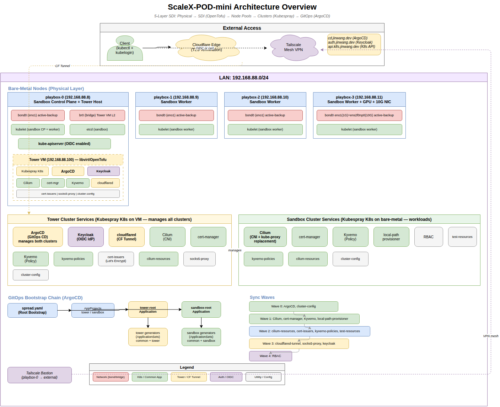

# ScaleX-POD-mini

**역할-기반 분리형 멀티-클러스터(Role-based Disaggregated Multi-cluster)** 아키텍처의 개발/검증 환경.

베어메탈 노드를 가상화(SDI)하여 멀티-클러스터를 구축하고, GitOps로 관리하는 통합 플랫폼입니다.

A unified platform that virtualizes bare-metal nodes via SDI (Software-Defined Infrastructure), provisions multi-cluster Kubernetes via Kubespray, and manages everything through ArgoCD GitOps.

---

## Architecture Overview



### 5-Layer SDI Architecture

```
Physical (bare-metal nodes)
  → SDI (OpenTofu virtualization → unified resource pool)
    → Node Pools (purpose-specific VM groups)
      → Clusters (Kubespray K8s provisioning)
        → GitOps (ArgoCD ApplicationSets for multi-cluster)
```

### Current Setup: 2-Cluster Design

| Cluster | Type | Location | Role |
|---------|------|----------|------|
| **Tower** | Kubespray K8s (SDI VM) | playbox-0 SDI VM | ArgoCD, Keycloak, cert-manager. Manages all clusters |
| **Sandbox** | Kubespray K8s (SDI VMs) | playbox-0~3 | Workloads. Cilium CNI, OIDC auth, Cloudflare Tunnel |

### External Access

```
kubectl (OIDC) → Cloudflare Edge (TLS) → CF Tunnel → cloudflared Pod → kube-apiserver
                                                    → Keycloak (auth.jinwang.dev)
                                                    → ArgoCD (cd.jinwang.dev)
```

No client-side software needed beyond `kubectl` + `kubelogin`.

---

## Design Philosophy

### 1. SDI — 하드웨어와 클러스터의 분리

물리 하드웨어와 K8s 클러스터를 **OpenTofu 가상화 레이어**로 분리합니다. 단일 노드에서도, 수천 개 노드에서도 동일한 워크플로우(`scalex sdi init → cluster init`)로 프로비저닝할 수 있습니다.

### 2. 무한 확장 멀티-클러스터

**템플릿 기반 Kubespray** 프로비저닝 + **ArgoCD ApplicationSets**로 클러스터를 찍어내듯 생성합니다. 새 클러스터 추가: `sdi-specs.yaml` pool 추가 → `k8s-clusters.yaml` cluster 정의 → `gitops/generators/` generator 추가 → 완료.

### 3. 역할-기반 분리형 아키텍처

**Tower** 클러스터가 메타-관리 역할(ArgoCD, Keycloak, cert-manager)을 담당하고, 워크로드 클러스터(sandbox 등)는 역할별로 분리/확장 가능합니다.

### 4. 이중 접근성과 보안

공인 IP 유무에 관계없이 **Cloudflare Tunnel + Tailscale**로 외부 접근을 보장합니다. OIDC(Keycloak) 기반 인증으로 별도 VPN 없이 `kubectl` 접근이 가능합니다.

### 5. 뉴비 친화적 + 맞춤형 최적화

`scalex` CLI 하나만 이해하면 전체 인프라를 운용할 수 있습니다. 내부적으로 bare-metal 하드웨어 정보를 수집(`scalex facts`)하고 커널 파라미터 튜닝(`scalex kernel-tune`)을 지원합니다.

### 6. 2-Layer 템플릿 관리

| Layer | Value Files | Scope |
|-------|-------------|-------|
| **Infrastructure** | `config/sdi-specs.yaml` + `credentials/.baremetal-init.yaml` | 물리→가상화(SDI) + K8s 프로비저닝 |
| **GitOps** | `config/k8s-clusters.yaml` + `gitops/` YAMLs | 멀티-클러스터 형상 관리 (ArgoCD) |

### 7. Test-Driven Development

모든 개발은 테스트 먼저 설계, 최소 기능 단위로 RED→GREEN→REFACTOR 사이클을 진행합니다.

---

## Installation Guide

> 완전히 초기화된 베어메탈에서 `scalex get clusters`까지 — 단계별 가이드

### Step 0: 전제 조건 확인

```bash
# 필수 도구 설치
# Rust
curl --proto '=https' --tlsv1.2 -sSf https://sh.rustup.rs | sh
source $HOME/.cargo/env

# Ansible + Python
sudo apt install -y ansible python3-pip sshpass
pip install jinja2 pyyaml

# OpenTofu (libvirt 가상화 엔진)
curl -fsSL https://get.opentofu.org/install-opentofu.sh | sudo bash -s -- --install-method standalone

# kubectl
curl -LO "https://dl.k8s.io/release/$(curl -L -s https://dl.k8s.io/release/stable.txt)/bin/linux/amd64/kubectl"
sudo install -o root -g root -m 0755 kubectl /usr/local/bin/kubectl

# 설치 확인
cargo --version          # Rust 도구 체인
ansible --version        # Ansible 자동화
tofu --version           # OpenTofu (Terraform 호환)
kubectl version --client # Kubernetes CLI
```

### Step 0.5: 레포지토리 클론 및 서브모듈 초기화

```bash
git clone https://github.com/JinwangMok/ScaleX-POD-mini.git
cd ScaleX-POD-mini
git submodule update --init --recursive  # Kubespray v2.30.0 서브모듈 필수
```

### Step 1: CLI 빌드

```bash
cd scalex-cli && cargo build --release
# 바이너리 위치: target/release/scalex
export PATH="$PWD/target/release:$PATH"
scalex --help  # CLI 동작 확인
cd ..
```

### Step 1.5: Pre-flight 점검

CLI 빌드 후, 베어메탈 노드에 SSH 접근이 가능한지 먼저 확인합니다.

```bash
# 1) bastion 노드(playbox-0)에 직접 SSH 접근 테스트
#    LAN에 있다면 LAN IP, 외부라면 Tailscale IP 사용
ssh jinwang@100.64.0.1 'hostname && uname -r'
# 출력 예: playbox-0 / 6.x.x-generic

# 2) bastion 경유 다른 노드 접근 테스트
ssh -J jinwang@100.64.0.1 jinwang@192.168.88.9 'hostname'
# 출력 예: playbox-1

# 3) libvirt 설치 확인 (SDI에 필요 — 각 노드에서)
ssh jinwang@100.64.0.1 'virsh version 2>/dev/null && echo "libvirt OK" || echo "libvirt NOT installed"'
# libvirt가 없으면 Step 4에서 scalex sdi init이 자동 설치를 시도합니다.
```

> **실패 시**: SSH 접근이 안 되면 이후 모든 단계가 실패합니다.
> - 비밀번호 인증: `sshpass`가 설치되어 있는지 확인 (`apt install sshpass`)
> - 키 인증: `~/.ssh/id_ed25519` (또는 지정 키)가 존재하고 원격 노드의 `authorized_keys`에 등록되었는지 확인
> - Tailscale 경유: `tailscale status`로 연결 상태 확인

### Step 2: 사용자 설정 파일 준비

4개의 설정 파일을 example에서 복사한 뒤 실제 값을 입력합니다.

**2-1. 베어메탈 노드 접근 정보** (`credentials/.baremetal-init.yaml`)

```bash
cp credentials/.baremetal-init.yaml.example credentials/.baremetal-init.yaml
```

이 파일은 3가지 SSH 접근 방식을 지원합니다:

| 접근 방식 | 설정 | 사용 시나리오 |
|-----------|------|-------------|
| **직접** | `direct_reachable: true` + `node_ip` | 동일 LAN에서 bastion 없이 접근 |
| **외부 IP 경유** | `direct_reachable: false` + `reachable_node_ip` | Tailscale IP 등으로 외부에서 접근 |
| **ProxyJump** | `direct_reachable: false` + `reachable_via: [노드명]` | bastion 경유 내부 노드 접근 |

편집 포인트:
- `node_ip`: 각 노드의 LAN IP (예: `192.168.88.8`, `192.168.88.9`, ...)
- `reachable_node_ip`: Tailscale IP 등 외부에서 접근 가능한 IP (bastion만 필요)
- `adminUser`: SSH 사용자명 (모든 노드 동일하면 하나만 변경)
- `sshPassword`: `.env`에서 정의할 환경변수 이름 (값이 아님!)

**2-2. SSH 비밀번호/키 경로** (`credentials/.env`)

```bash
cp credentials/.env.example credentials/.env
```

```dotenv
# 실제 비밀번호로 변경 (따옴표 필수)
PLAYBOX_0_PASSWORD="실제비밀번호"
PLAYBOX_1_PASSWORD="실제비밀번호"
PLAYBOX_2_PASSWORD="실제비밀번호"
PLAYBOX_3_PASSWORD="실제비밀번호"

# 키 인증 시 실제 경로로 변경
SSH_KEY_PATH="~/.ssh/id_ed25519"
```

**2-3. SDI 가상화 스펙** (`config/sdi-specs.yaml`)

```bash
cp config/sdi-specs.yaml.example config/sdi-specs.yaml
```

편집 포인트:
- `spec.sdi_pools[].node_specs[].cpu/mem_gb/disk_gb`: VM당 리소스 (물리 노드 리소스를 초과하지 않게 설정)
- `spec.sdi_pools[].node_specs[].ip`: VM에 할당할 IP (LAN 대역 내, 물리 IP와 겹치지 않게)
- `spec.sdi_pools[].node_specs[].host`: VM이 실행될 물리 노드 이름

**2-4. K8s 클러스터 설정** (`config/k8s-clusters.yaml`)

```bash
cp config/k8s-clusters.yaml.example config/k8s-clusters.yaml
```

편집 포인트:
- `config.clusters[].cluster_sdi_resource_pool`: sdi-specs.yaml의 `pool_name`과 일치시킬 것
- `config.clusters[].network.pod_cidr`: 클러스터 간 겹치지 않게 (예: tower=`10.233.0.0/16`, sandbox=`10.234.0.0/16`)
- `config.common.kubernetes_version`: 모든 클러스터에 동일 적용 (ClusterMesh 호환성)
- `config.argocd.repo_url`: 본인의 GitHub repo URL (모든 클러스터에 공통)

**검증**

```bash
# 4개 파일의 존재 여부 + YAML 유효성 검증
scalex get config-files
# 모든 항목이 OK 또는 Present이면 통과
```

### Step 3: 하드웨어 정보 수집

```bash
scalex facts --all
# 각 노드에 SSH 접속하여 CPU, memory, GPU, disk, NIC, kernel 정보 수집
# 결과: _generated/facts/{node-name}.json

# 단일 노드만 수집 (디버깅용)
scalex facts --host playbox-0

# 수집 결과 확인
scalex get baremetals
```

> **실패 시**: `SSH connection failed` → Step 1.5의 SSH 접근 테스트를 다시 확인하세요.
> `Permission denied` → `.env`의 비밀번호 또는 SSH 키가 올바른지 확인하세요.

### Step 4: SDI 가상화 (OpenTofu)

```bash
# 베어메탈 → VM 풀 생성 (tower + sandbox)
scalex sdi init config/sdi-specs.yaml
# 결과: _generated/sdi/ (HCL 파일 생성 + tofu apply 실행)
# 소요 시간: 노드당 ~5분 (libvirt 설치 + VM 생성)

# VM 풀 상태 확인
scalex get sdi-pools
```

> **사전 요구**: 각 노드에 libvirt가 설치되어 있어야 합니다. 미설치 시 `scalex sdi init`이 ansible을 통해 자동 설치를 시도합니다.
> **실패 시**: `libvirt connection failed` → 각 노드에서 `sudo systemctl status libvirtd` 확인

### Step 5: K8s 클러스터 프로비저닝 (Kubespray)

```bash
# SDI VM 풀 → K8s 클러스터 생성
scalex cluster init config/k8s-clusters.yaml
# Kubespray 실행으로 K8s 클러스터 구축
# 소요 시간: 클러스터당 ~15-30분 (Kubespray 풀 프로비저닝)
# 결과: _generated/clusters/{name}/ (inventory.ini + group_vars + kubeconfig.yaml)

# Tower 클러스터 접근 확인
export KUBECONFIG=_generated/clusters/tower/kubeconfig.yaml
kubectl get nodes

# Sandbox 클러스터 접근 확인
export KUBECONFIG=_generated/clusters/sandbox/kubeconfig.yaml
kubectl get nodes

# 멀티-클러스터 목록 확인
scalex get clusters
```

> **소요 시간 참고**: Kubespray는 노드 OS 패키지 설치 → containerd → etcd → K8s 순서로 진행되며, 네트워크 환경에 따라 15~30분 소요됩니다.
> **중간 실패 시**: `scalex cluster init`은 멱등성을 보장하므로 동일 명령을 재실행하면 실패 지점부터 이어서 진행합니다.

### Step 6: 사전 시크릿 배포

```bash
# Tower 클러스터에 Cloudflare tunnel, Keycloak 등 시크릿 생성
export KUBECONFIG=_generated/clusters/tower/kubeconfig.yaml
scalex secrets apply
```

> **중요**: Cloudflare Tunnel 사용 시, 이 단계 **이전에** [Cloudflare Zero Trust Dashboard](https://one.dash.cloudflare.com/)에서 터널을 생성하고 credentials를 `credentials/cloudflare-tunnel.json`에 저장해야 합니다. 이 파일이 없으면 Step 7에서 cloudflared Pod가 기동 실패합니다. 상세: [docs/ops-guide.md](docs/ops-guide.md)

### Step 7: GitOps 부트스트랩 (ArgoCD)

```bash
# 반드시 Tower 클러스터의 kubeconfig를 사용
export KUBECONFIG=_generated/clusters/tower/kubeconfig.yaml
kubectl apply -f gitops/bootstrap/spread.yaml

# ArgoCD가 모든 앱을 자동 배포 (sync wave 순서)
# Wave 0: ArgoCD, cluster-config
# Wave 1: Cilium, cert-manager, Kyverno, local-path-provisioner
# Wave 2: cilium-resources, cert-issuers, kyverno-policies
# Wave 3: cloudflared-tunnel, keycloak
# Wave 4: RBAC

# 배포 진행 상황 확인 (수 분 소요)
kubectl -n argocd get applications -w
# 모든 앱이 Synced/Healthy가 될 때까지 대기
```

> **주의**: `KUBECONFIG`가 Tower를 가리키는지 반드시 확인하세요. Sandbox kubeconfig로 실행하면 ArgoCD가 잘못된 클러스터에 배포됩니다.

### Step 8: 최종 검증

```bash
# 전체 플랫폼 상태 확인
scalex status

# 클러스터 인벤토리
scalex get clusters

# ArgoCD 앱 상태 (tower 클러스터에서)
export KUBECONFIG=_generated/clusters/tower/kubeconfig.yaml
kubectl -n argocd get applications

# 외부 접근 테스트 (Cloudflare Tunnel 설정 완료 시)
# ArgoCD: https://cd.jinwang.dev
# Keycloak: https://auth.jinwang.dev
```

### 트러블슈팅

| 증상 | 원인 | 해결 |
|------|------|------|
| `scalex get config-files`에서 Missing | 설정 파일 미복사 | Step 2에서 `cp` 명령 재확인 |
| `scalex facts`에서 SSH 실패 | SSH 접근 불가 | Step 1.5 pre-flight 점검 |
| `scalex sdi init`에서 libvirt 오류 | libvirt 미설치/미실행 | 각 노드에서 `sudo apt install -y libvirt-daemon-system` |
| `scalex cluster init` 중간 실패 | 네트워크/패키지 문제 | 동일 명령 재실행 (멱등성 보장) |
| ArgoCD 앱 OutOfSync | Git repo URL 불일치 | `k8s-clusters.yaml`의 `argocd.repo_url` 확인 |
| cloudflared Pod CrashLoop | tunnel credentials 미설정 | Step 6 참고 + `credentials/cloudflare-tunnel.json` 확인 |

상세: [docs/TROUBLESHOOTING.md](docs/TROUBLESHOOTING.md)

---

## Quick Reference

```bash
scalex facts --all                          # HW 정보 수집
scalex sdi init config/sdi-specs.yaml       # VM 풀 생성
scalex cluster init config/k8s-clusters.yaml # K8s 클러스터 생성
scalex secrets apply                         # 시크릿 배포
scalex status                               # 전체 상태
scalex get clusters                         # 클러스터 목록
scalex sdi clean --hard --yes-i-really-want-to  # 전체 초기화
```

See [docs/SETUP-GUIDE.md](docs/SETUP-GUIDE.md) for detailed instructions.

---

## CLI Reference (`scalex`)

### Core Commands

| Command | Description |
|---------|-------------|
| `scalex facts --all` | Gather hardware info from all bare-metal nodes |
| `scalex facts --host <name>` | Gather from a single node |
| `scalex sdi init <sdi-specs.yaml>` | Virtualize bare-metal → resource pool → VM pools |
| `scalex sdi clean --hard --yes-i-really-want-to` | Full infrastructure reset |
| `scalex sdi sync` | Reconcile bare-metal changes (add/remove nodes) |
| `scalex cluster init <k8s-clusters.yaml>` | Kubespray → multi-cluster provisioning |
| `scalex secrets apply` | Generate and apply pre-bootstrap K8s secrets |

### Query Commands

| Command | Description |
|---------|-------------|
| `scalex get baremetals` | Hardware facts table |
| `scalex get sdi-pools` | VM pool status |
| `scalex get clusters` | Cluster inventory |
| `scalex get config-files` | Config file validation |
| `scalex status` | 5-layer platform status report |
| `scalex kernel-tune` | Kernel parameter recommendations and diff |

---

## GitOps Pattern

### Bootstrap Chain

```
kubectl apply -f gitops/bootstrap/spread.yaml
  → tower-root Application → gitops/generators/tower/
    → common-generator (ApplicationSet) → gitops/common/{app}/
    → tower-generator (ApplicationSet)  → gitops/tower/{app}/
  → sandbox-root Application → gitops/generators/sandbox/
    → common-generator (ApplicationSet) → gitops/common/{app}/
    → sandbox-generator (ApplicationSet) → gitops/sandbox/{app}/
```

### Sync Waves

| Wave | Components |
|------|-----------|
| 0 | ArgoCD, cluster-config |
| 1 | Cilium, cert-manager, Kyverno, local-path-provisioner |
| 2 | cilium-resources, cert-issuers, kyverno-policies |
| 3 | cloudflared-tunnel, socks5-proxy, keycloak |
| 4 | RBAC |

### Adding Apps

**Common app (all clusters):**
1. Create `gitops/common/{app}/kustomization.yaml`
2. Add element to both `gitops/generators/tower/common-generator.yaml` and `gitops/generators/sandbox/common-generator.yaml`

**Cluster-specific app:**
1. Create `gitops/{tower|sandbox}/{app}/kustomization.yaml`
2. Add element to `gitops/generators/{tower|sandbox}/{tower|sandbox}-generator.yaml`

---

## Project Structure

```
scalex-cli/                # Rust CLI — 352 tests, 0 clippy warnings
  src/commands/            #   facts, sdi, cluster, get, status, kernel-tune, secrets
  src/core/                #   config, kubespray, tofu, gitops, kernel, validation, ...
  src/models/              #   baremetal, cluster, sdi data models
gitops/                    # ArgoCD-managed multi-cluster GitOps
  bootstrap/spread.yaml    #   Root bootstrap (tower-root + sandbox-root)
  generators/              #   ApplicationSets per cluster
  projects/                #   AppProjects (tower, sandbox)
  common/                  #   All clusters: cert-manager, cilium-resources, kyverno, kyverno-policies
  tower/                   #   Tower-only: argocd, cert-issuers, cilium, cloudflared-tunnel, cluster-config, keycloak, socks5-proxy
  sandbox/                 #   Sandbox-only: cilium, cluster-config, local-path-provisioner, rbac, test-resources
credentials/               # Secrets + init config (gitignored, .example templates)
config/                    # User config: sdi-specs.yaml, k8s-clusters.yaml
docs/                      # Architecture, setup guide, ops guide, troubleshooting
ansible/                   # Node preparation playbooks
kubespray/                 # Kubespray submodule (v2.30.0) + templates
client/                    # OIDC kubeconfig generation
tests/                     # Test runner + YAML lint
_generated/                # Gitignored output (facts, SDI HCL, cluster configs)
```

---

## Testing

```bash
# All tests (Rust + YAML lint + clippy + fmt)
./tests/run-tests.sh

# Rust CLI tests only
cd scalex-cli && cargo test
```

---

## Documentation

| Document | Description |
|----------|-------------|
| [SETUP-GUIDE](docs/SETUP-GUIDE.md) | Full provisioning walkthrough |
| [ARCHITECTURE](docs/ARCHITECTURE.md) | Two-cluster design, network, access paths |
| [ops-guide](docs/ops-guide.md) | Cloudflare Tunnel, Keycloak, kernel tuning, external access |
| [TROUBLESHOOTING](docs/TROUBLESHOOTING.md) | Common issues and fixes |
| [CONTRIBUTING](docs/CONTRIBUTING.md) | Code style, testing, git conventions |
| [CLOUDFLARE-ACCESS](docs/CLOUDFLARE-ACCESS.md) | Cloudflare Tunnel setup details |
| [NETWORK-DISCOVERY](docs/NETWORK-DISCOVERY.md) | NIC discovery and bond configuration |

---

## Diagram Sources

| Diagram | Source |
|---------|--------|
| Architecture Overview | [architecture-overview.drawio](docs/architecture-overview.drawio) |
| Provisioning Flow | [provisioning-flow.drawio](docs/provisioning-flow.drawio) |

> Edit with [app.diagrams.net](https://app.diagrams.net/) or VS Code draw.io extension.
